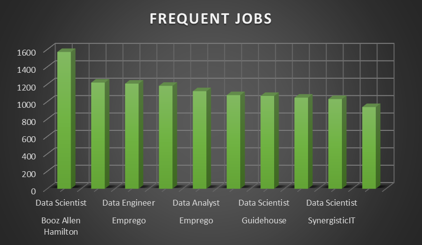
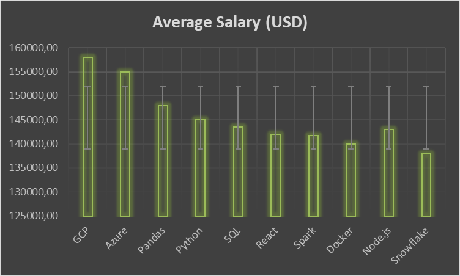
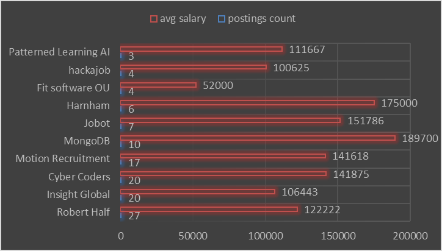

<<<<<<< HEAD
# 📌MULTI_PROJECT 

 This project is a continuation of a previous analysis using the same job market database. While the initial project focused on analyzing Data Analyst roles associated skills, highest salary and optimal skills, this second phase dives deeper into SQL-Based Insights on Job Opportunities & Hiring Trends. The analysis pinpoints high-value skills, top remote-friendly employers, and patterns in job offerings that go beyond basic listings — valuable for both tech professionals and workforce analysts.

#### **SQL query : [multi-project](/JobAnalytics_v2/)**

# 🧠 BACKGROUND 

In today's dynamic job market, understanding how skills, salary, and work flexibility intersect is essential for both job seekers and employers. The dataset used in this project comes from a comprehensive job listings database that includes thousands of roles in the tech sector, detailing job titles, required skills, salaries, remote options, and degree requirements.

This project builds on a previous analysis where the focus was on broader job trends such as top hiring companies, salary distributions, and job title frequencies. In this second phase, the focus shifts toward more targeted insights — particularly:

- How specific skill sets relate to above-average salaries

- Which companies offer remote work without requiring a degree

- How the number of skills affects salary outcomes

- Which roles dominate the data-driven job space

By refining the analytical focus, this phase aims to uncover more strategic insights relevant to job seekers aiming to position themselves competitively in the tech field

# 🔁 RELATED WORK 

This project is a direct continuation of my earlier analysis on the same job listings dataset, completed in **[Project 1](https://github.com/HardyTmp1/SQL_First_Project.git)** . The initial project focused on foundational trends such as:

- Top-paying job titles across the dataset✨

- Highest-paying individual skills💲

- Most frequently demanded skills by employers🎩

- Optimal skill combinations that appear in high-paying roles💯

- Job roles tied to premium skill sets✨

That foundational work helped identify which jobs and skills hold the highest market value. However, it focused more on individual metrics and ranking-based insights.

This second project expands the analysis by addressing how skills interact with other factors like:

- Salary thresholds (above-average salaries)💰

- Remote work opportunities and constraints🎯

- Multi-skill requirements per role🚀

- Hiring companies that offer flexibility without demanding a degree✅

By shifting toward multi-dimensional and accessibility-focused insights, this project complements the first by offering a deeper strategic understanding of the dataset — especially for job seekers looking for remote roles or alternative career paths.

# 📊 THE ANALYSIS

This analysis explores key job market factors by leveraging SQL queries designed to extract actionable insights from a tech-focused job listings dataset.

Each query is built around a specific question, with the goal of uncovering patterns that can help job seekers, recruiters, and analysts better understand what drives opportunity in the tech job landscape.

### 1. **Most data-related jobs🚀**

This query identifies companies that most frequently post jobs with titles starting with "Data" (e.g., Data Analyst, Data Scientist). By joining job postings with company information, it highlights which companies are most active in hiring for data-related roles. The results are sorted by the number of such job postings per company, offering insight into top employers in the data domain.

``` SQL
SELECT 
    c.name, 
    j.job_title_short AS JOBS,
    COUNT(j.job_title_short) as COUNT_JOBS
FROM
    company_dim as c 
INNER JOIN job_postings_fact as j 
ON c.company_id = j.company_id 
WHERE 
    job_title_short LIKE 'Data%'
GROUP BY 
    c.name,
    j.job_title_short
ORDER BY 
    count_JOBS DESC
LIMIT 100;
```
This chart illustrates the top companies with the highest number of job postings for roles starting with "Data" (e.g., Data Analyst, Data Scientist). It offers a quick visual reference for identifying the most active employers in the data domain.




### 2. **Above average skill salaries💲**

This query identifies skills associated with job postings that offer above-average annual salaries. 

**Method:**
We first calculated the global average salary across all job postings. Then, we computed the average salary per skill by aggregating salaries from postings mentioning each skill. Finally, we filtered for skills whose average salary exceeds the global benchmark.

```SQL
WITH global_salary as ( 
    SELECT
        AVG(salary_year_avg) global_avg_salary
    FROM 
        job_postings_fact 
),
Skills_salary as (
    SELECT 
        sd.skills,
        AVG(j.salary_year_avg) AVG_SALARY
    FROM 
        job_postings_fact j 
    INNER JOIN skills_job_dim sjd on j.job_id = sjd.job_id 
    INNER JOIN skills_dim sd on sjd.skill_id = sd.skill_id
    GROUP BY skills
)
SELECT 
    ss.skills,
    ss.AVG_SALARY 
FROM 
    Skills_salary ss
CROSS JOIN global_salary gs
WHERE ss.avg_salary  > gs.global_avg_salary
```
**Purpose:**
This helps pinpoint high-value technical skills in the job market — skills that are more likely to land candidates in better-paying roles.

**Outcome:**
The resulting visualization highlights these premium-paying skills, which can guide learners, job seekers, and career switchers in choosing in-demand skills with better salary potential.



### 3. **Remote jobs with skillset🏡**

This query identifies a selection of remote job postings that:

- Offer a disclosed average salary

- Require exactly three distinct technical skills

By aggregating skill sets and highlighting the maximum salary per job, this analysis provides a snapshot of concise, skill-specific remote roles — ideal for individuals seeking focused upskilling or quick transitions into tech.

``` SQL
SELECT DISTINCT
    j.job_id ID,
    j.job_title_short JOBS,
    string_agg(distinct sk2.skills,' | ') as SKILLSET,
    ROUND(MAX(j.salary_year_avg),0) MAX_SALARY
FROM 
    job_postings_fact j 
JOIN skills_job_dim as sk ON j.job_id = sk.job_id  
INNER JOIN skills_dim as sk2 ON sk.skill_id = sk2.skill_id 
WHERE 
    j.job_work_from_home = 'TRUE' and 
    j.salary_year_avg is not NULL
GROUP BY   
    j.job_id ,
    j.job_title_short
HAVING count(distinct sk2.skills) = 3
LIMIT 5 ;
```
## **Wrapped to the JSON**

```SQL
SELECT json_agg(result)
FROM (
  SELECT DISTINCT
    j.job_id ID,
    j.job_title_short JOBS,
    string_agg(distinct sk2.skills,' | ') as SKILLSET,
    ROUND(MAX(j.salary_year_avg),0) MAX_SALARY
    FROM 
        job_postings_fact j 
    JOIN skills_job_dim as sk ON j.job_id = sk.job_id  
    INNER JOIN skills_dim as sk2 ON sk.skill_id = sk2.skill_id 
    WHERE 
        j.job_work_from_home = 'TRUE' and 
        j.salary_year_avg is not NULL
    GROUP BY   
        j.job_id ,
        j.job_title_short
    HAVING count(distinct sk2.skills) = 3
    LIMIT 5
) result;
```

- **Why it matters:**
Roles requiring fewer (yet high-impact) skills may be more accessible and achievable for career switchers or early-stage professionals targeting remote opportunities.

- **Insight:**
It showcases that well-paying, flexible jobs often demand only a targeted set of three core skills, emphasizing quality over quantity in candidate capabilities.

| id    | jobs                 | skillset                    | max_salary |
| :---- | :------------------- | :------------------------   | :--------- |
| 294   | Data Scientist       | python \| sql \| tensorflow | 90000      |
| 712   | Data Scientist       | nosql \| python \| sql      | 88535      |
| 1531  | Data Engineer        | sql \| ssis \| tableau      | 117500     |
| 2695  | Data Engineer        | flow \| java \| python      | 55000      |
| 16265 | Senior Data Engineer | aws \| azure \| gcp         | 140000     |

This table provides a snapshot of various job postings, detailing their unique id, jobs title, the skillset required (separated by |), and the max_salary offered for each role. It highlights the diverse technical requirements and salary ranges across different data-related positions.

### 4. **Skill count 🆚 Salary**

📊 Query: Relationship Between Number of Skills Required and Average Salary

This SQL query is designed to analyze the correlation between the number of distinct skills listed in job postings and the average annual salary offered for those positions. It does this by aggregating and joining data from a job postings fact table and a job-skill mapping dimension table. The results can help identify whether job listings requiring more skills tend to offer higher average salaries.

```SQL 
WITH number_of_skills as (
SELECT DISTINCT
    j.job_id ID, 
    count(distinct sjd.skill_id) count_skills
FROM job_postings_fact j 
INNER JOIN skills_job_dim sjd ON j.job_id = sjd.job_id 
GROUP BY 
    ID
),
job_salary as (
    SELECT
        j.job_id ID,
        j.salary_year_avg SALARY 
    FROM job_postings_fact j 
    WHERE j.salary_year_avg is not NULL
    ORDER BY ID asc
)
SELECT 
    ns.count_skills,
    round(avg(js.salary),0) SALARY
FROM 
    number_of_skills ns
INNER JOIN job_salary js on ns.id = js.id
GROUP BY 
    count_skills
ORDER BY 
    count_skills
```

**✅ Purpose:**
This query provides valuable insights for job market analysis, particularly for:

- **Job seekers:** Understanding how the breadth of skills affects salary expectations.

- **Employers and recruiters:** Evaluating whether requiring more skills aligns with competitive compensation.

- **Career counselors and educators:** Advising on in-demand skillsets and their economic value.


### 5. **Companies Hiring with No degree**

**💼 Query:** Top Companies Offering Remote Jobs That Don’t Require a Degree

This SQL query identifies companies that most actively post remote job opportunities which do not require a college degree, while also reporting the average annual salary offered for those roles. The results are ranked by the number of such job postings per company and limited to the top 50 companies.

```SQL
WITH filtered_jobs AS (
    SELECT
        j.job_id,
        j.company_id,
        j.salary_year_avg
    FROM 
        job_postings_fact j
    WHERE 
        j.job_no_degree_mention = 'TRUE'
        AND j.job_work_from_home = 'TRUE'
        AND j.salary_year_avg IS NOT NULL
)

SELECT
    c.name AS company_name,
    COUNT(fj.job_id) AS job_posting_count,
    ROUND(AVG(fj.salary_year_avg), 0) AS avg_salary
FROM 
    filtered_jobs fj
JOIN company_dim c ON fj.company_id = c.company_id
GROUP BY 
    c.name
ORDER BY 
    job_posting_count DESC
LIMIT 50;
``` 
**✅ Purpose:**
This query provides meaningful insights for a range of stakeholders:

- **Job seekers without degrees:** Helps identify companies offering the most remote-friendly, degree-optional opportunities.

- **Workforce analysts:** Tracks which companies are most inclusive in terms of education requirements.

- **Policy makers or NGOs:** Assists in identifying employers who provide equitable job access.

- **Employers:** Benchmarks industry behavior regarding education flexibility and remote work support.



This output highlights the most active companies hiring for high-paying, remote roles that do not require a formal degree, empowering job seekers with actionable data.

# 🛠️ TOOLS I USED 

- SQL – For querying and analyzing the data.

- PostgreSQL – As the database environment.

- DB Fiddle – For testing and writing SQL queries online.

- Excel – For creating visualizations like bar charts.

Note: All visualizations in this project were created using Microsoft Excel for quick and clear representation of query results.

# ✅CONCLUSION 

This project provided key insights into the tech job market by analyzing job roles, required skills, and salary trends using SQL. By focusing on data-related positions, remote opportunities, and skill-based salary comparisons, it highlighted the most valuable technologies and roles in demand. The findings not only guide career decisions but also emphasize the importance of targeted upskilling for better opportunities in a competitive job landscape.

In addition, this analysis lays a strong foundation for future work — such as integrating time-based trends, automating job tracking pipelines, or applying machine learning to predict high-paying skills — to further deepen market understanding and enhance career planning.


=======
update it later
>>>>>>> 6b36b1f83bdbe85691a85840b8abb1b6f3c613ba
